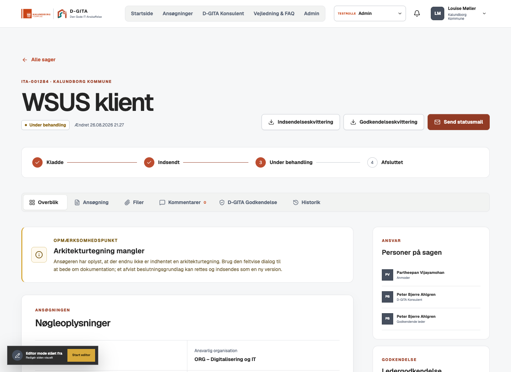
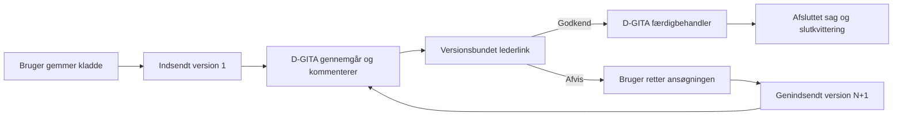
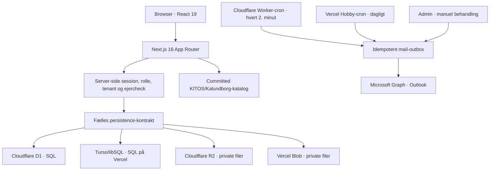

# D-GITA · Den Gode IT-Anskaffelse

En moderne, webbaseret portal til kommunale IT-anskaffelser. Løsningen samler ansøgning, dokumentation, sagsbehandling, ledergodkendelse, Outlook-mail, PDF-kvitteringer og administration i ét responsivt workspace.

Nye testsager og testidentiteter bruger syntetiske fixtures. Den eksisterende pilots identiteter og indhold bevares ved opgradering; kildens vejledningsmateriale gennemgås særskilt i datafortegnelsen. Systemkataloget er normaliseret fra de udleverede KITOS- og Kalundborg-regneark og følger med repositoryet som deploybar runtime-data.


## Visuel identitet

Portalens primære tema følger Kalundborg Kommunes webidentitet med terracotta, hvide/neutralgrå arbejdsflader og mørk tekst. Det officielle Kalundborg-logo bruges i lokal SVG-kopi fra kommunens [logo- og designside](https://www.kalundborg.dk/kommunen/presse-og-kommunikation/billeder-logo-og-design). D-GITA vises som produktnavn, mens det separate officielle DIGIT-logo repræsenterer [Digitaliseringsforeningen Sjælland](https://digitaliseringsforeningen.dk/).

Komponenterne er forfinet med inspiration fra [Fisher UI](https://jakobfisker.dk/da/ui): kompakte segmenterede valg, diskrete kanter, lette skygger og konsekvente afrundinger. Designprincipperne er implementeret i egen CSS/React; der er ikke importeret komponentkode eller nye biblioteker. Navigationen tilpasser sig alle tre roller, svargrupper understøtter piletaster/Home/End og spørgsmålsnavne til skærmlæsere, og animationer respekterer reduceret bevægelse. Formularmotor, adgangsregler og data er uændrede.



## Status

Den lokale [K01–K12-kandidat og dens restopgaver](docs/candidate-readiness.md) samler implementering, reproducerbare prøver og grænserne for evidensen. [Miljøacceptpakken](docs/municipal-acceptance.md) beskriver de efterfølgende kommunale prøver.

Fremtidigt arbejde og releases hører til [DGITA_codereviewed](https://github.com/Parthee-Vijaya/DGITA_codereviewed). Det tidligere DGITA-repo er bevaret som `upstream`. Produktionsforberedelserne omfatter sikkerhedsrettelser og CI/CD, men en kommunal produktionsaccept kræver stadig de eksterne kontroller i [driftsvejledningen](docs/production-operations.md).

Seneste [robusthedsgennemgang og produktionscheckliste](docs/enterprise-review.md) beskriver rettelserne i kladder, samtidige redigeringer, statusskift, dokumenter, mail, PDF, admin og UX. Portalen er fortsat et test-/pilotmiljø — ikke en certificeret enterprise-produktionsløsning.

| Område | Status |
| --- | --- |
| Formular, kladder og bilag | Implementeret med D1/R2 lokalt/Cloudflare og Turso/privat Blob på Vercel |
| Roller og adgangskontrol | Bruger, D-GITA-konsulent og Admin |
| Lederens godkendelsesflow | Versionsbundet link med 7 dages beslutningsfrist og én irreversibel beslutning |
| Rettelse og genindsendelse | Ny låst version N+1 med CAS-konfliktbeskyttelse |
| PDF-kvitteringer | Indsendelse, ledergodkendelse og afslutning |
| Outlook-mail | Graph-adapter og idempotent outbox implementeret; kræver tenant-konfiguration |
| Admin og visuel editor | Redaktionelt indhold, FAQ, links, hjælp og tre billedplaceringer |
| SSO | Entra OIDC med PKCE, nonce, issuer/JWKS-validering og forhåndstildelte roller; live-accept i kommunens tenant udestår |
| Driftsmodeller | Cloudflare Worker/Sites med D1/R2 eller Vercel med Turso/privat Blob |

## Brugeroplevelsen

Formularen består af 10 logiske trin og tilpasser sig brugerens svar. Den indeholder 13 dokumenterede betingelsesregler, fem dokumentflows og en dynamisk gennemgang før indsendelse.

<table>
  <tr>
    <td width="50%"></td>
    <td width="50%"></td>
  </tr>
  <tr>
    <td align="center"><strong>Trinvis ansøgning</strong><br>Betingede spørgsmål, KITOS-opslag, validering og uploads.</td>
    <td align="center"><strong>Vejledning og FAQ</strong><br>Fuzzy-søgning finder relevante svar trods realistiske stavefejl.</td>
  </tr>
</table>

Formularmotoren understøtter blandt andet:

- automatisk visning og skjulning af underspørgsmål
- søgning i 4.656 KITOS-systemer og markering af 420 UUID-matchede Kalundborg-systemer
- lokale aliaser og tidligere systemnavne uden at bruge navne som join-nøgle
- upload af risikovurdering, databehandleraftale, kontrakt, leverandørtjekliste og arkitekturmateriale
- filtype-, MIME- og størrelseskontrol samt SHA-256-registrering; højst 25 MB pr. fil
- dansk beløbsformat, beregnet finansiering og kontrol af implementeringsdatoer
- sikre, brugerejede kladder med individuel fortsættelse, beskyttelse af ugemte ændringer og konfliktkontrol mellem parallelle faner
- versionslåst snapshot og bilagsmanifest ved indsendelse
- rettelse efter afvisning, hvor den tidligere version og kvittering forbliver uforanderlig

## Roller

| Rolle | Adgang og opgaver |
| --- | --- |
| **Bruger** | Opretter ansøgninger, uploader dokumenter, læser kommentarer og ser kun egne sager i egen kommune. Interne D-GITA-felter udleveres aldrig. |
| **D-GITA-konsulent** | Ser kommunens arbejdskø, kommenterer sagen eller konkrete felter, sender til ledergodkendelse og udfylder det interne D-GITA-arbejdsområde. |
| **Admin** | Har konsulentfunktionerne samt administration af redaktionelt indhold, FAQ, links, hjælp, billeder, mailkø og integrationsstatus. |

I det lokale testmiljø kan rollen skiftes i topbaren. Hvert skift opretter en ny servervalideret session; dropdownen er ikke en klient-side sikkerhedsgenvej. I drift skal den erstattes af rolleclaims fra Entra ID eller Fælleskommunal Adgangsstyring.

<table>
  <tr>
    <td width="50%"></td>
    <td width="50%"></td>
  </tr>
  <tr>
    <td align="center"><strong>D-GITA-arbejdsområde</strong><br>Interne vurderinger, feltkommentarer og fase.</td>
    <td align="center"><strong>Visuel editor</strong><br>Markeret redaktionelt indhold og billeder kan redigeres direkte på siden.</td>
  </tr>
</table>

Admin kan redigere registrerede portaltekster, formularhjælp, vejledning, FAQ, links og databehandlerkrav samt erstatte de tre centrale portalbilleder. Tekniske feltnøgler, valideringsregler, statusnavne og navigationslogik er bevidst kodeadministreret, så redaktionelle ændringer ikke kan bryde workflowet.

## Workflow fra ansøgning til afslutning



Vigtige overgange skrives til auditsporet; notifikation og relevant mail oprettes, når workflowet kræver udsendelse. Lederen modtager et versionsbundet beslutningsgrundlag, kan se de relevante bilag og kan kun afgive én irreversibel beslutning inden fristen. Efter beslutningen viser linket alene den registrerede status. Det rå godkendelsestoken gemmes aldrig i databasen.

Kvitteringer genereres som PDF fra den låste version:

- `submission` efter indsendelse
- `approval` efter lederens godkendelse
- `final` ved D-GITA-afslutning

PDF-bytes gemmes i det private objektlager med checksum. Mailkøen bruger idempotens, statusserne `queued`, `processing`, `sent`, `failed` og `cancelled` samt højst fem kontrollerede forsøg.

## Arkitektur



Teknologistakken er Next.js 16, React 19, TypeScript 5, Vinext/Vite, Cloudflare Worker, D1, R2, Turso/libSQL, privat Vercel Blob, Drizzle og `pdf-lib`. Den samme forretningslogik bruger en D1-kompatibel SQL-kontrakt på begge platforme. Der findes ingen LocalStorage- eller in-memory-fallback for forretningsdata: manglende storage-konfiguration får løsningen til at fejle lukket.

Datamodellen dækker tenants, brugere, roller, sessions, ansøgninger, uforanderlige versioner, bilag, indhold, billeder, D-GITA-vurderinger, kommentarer, audit, notifikationer, kvitteringer, mail-outbox og ledergodkendelser. SQL-triggers beskytter indsendte versioner, versionsbundne bilag og auditposter mod ændring.

## Sikkerhedsmodel

- Alle beskyttede portal-API-kald validerer session, rolle, tenant og eventuelt ejer-id på serveren.
- En almindelig bruger kan kun læse ansøgninger, hvor `owner_user_id` matcher den interne bruger, som serveren har opløst fra identity providerens stabile subject.
- Konsulent og Admin er kommuneafgrænset og ser aldrig en anden tenants sager.
- Mutationer kræver samme origin.
- Sessionstoken gemmes hashet i den autoritative SQL-database; cookien er `HttpOnly`, `SameSite=Lax` og `Secure` på HTTPS og udløber efter 12 timer.
- Offentlige godkendelsessider bruger `no-store`, `noindex`, frame-beskyttelse og `no-referrer`.
- Interne kommentarer og D-GITA-felter findes ikke i brugerens API-projektion eller PDF-kvittering.
- Secrets og Graph access tokens sendes aldrig til browseren.

## Lokal kørsel

Kræver Node.js `>=22.13.0`.

```bash
git clone https://github.com/Parthee-Vijaya/DGITA.git
cd DGITA
npm install
cp .env.example .env.local
npm run dev
```

Åbn derefter [http://localhost:3000](http://localhost:3000). Vinext starter lokal D1 og R2 gennem Miniflare; den ignorerede state gemmes under `.wrangler/`.

### Kør den fulde E2E-test

Start først portalen på testporten:

```bash
npm run dev -- --port 3001
```

Kør derefter i en anden terminal:

```bash
npm run test:e2e
```

## Miljøkonfiguration

Den komplette, secret-frie skabelon findes i [`.env.example`](.env.example).

### Vercel-storage, offentlige adresser og testlogin

En funktionel Vercel-deployment kræver disse storage-variabler:

```dotenv
TURSO_DATABASE_URL=libsql://<database>-<organisation>.turso.io
TURSO_AUTH_TOKEN=<database-token>
BLOB_STORE_ID=<private-blob-store-id>
NEXT_PUBLIC_DGITA_UPLOAD_MODE=vercel-blob
```

Blob-store skal være **privat**. Uploadtilstanden sender ansøgningsbilag direkte fra browseren til en kortlivet, signeret Blob-URL og bevarer dermed formularens grænse på 25 MB. Completion-kaldet sender kun metadata og verificerer den private Blob server-side. Downloads bruger tilsvarende et kortlivet, signeret redirect. Cloudflare anvender fortsat sit multipart-/streamingflow, hvor `NEXT_PUBLIC_DGITA_UPLOAD_MODE` udelades.

Uden alle tre storage-værdier findes der ingen browserbaseret fallback; login og datafunktioner fejler i stedet lukket. Konfigurér desuden deploymentens kanoniske HTTPS-adresse og separate tilfældige secrets:

```dotenv
DGITA_APP_ORIGIN=https://<produktion-alias>
NEXT_PUBLIC_SITE_URL=https://<produktion-alias>
DGITA_APPROVAL_TOKEN_SECRET=<mindst-32-tilfældige-tegn>
CRON_SECRET=<mindst-32-tilfældige-tegn>
```

`DGITA_ENABLE_DEV_LOGIN=true` aktiverer de fiktive testidentiteter og rolle-dropdownen. På andre værter end localhost skal der samtidig konfigureres en `DGITA_TEST_ACCESS_SECRET` på mindst 8 tegn. Første testlogin kræver denne adgangskode, mens en allerede godkendt testsession fortsat kan skifte testrolle uden at indtaste den igen. Mangler serverkoden, eller er den for kort, fejler testlogin lukket.

```dotenv
DGITA_ENABLE_DEV_LOGIN=true
DGITA_TEST_ACCESS_SECRET=<mindst-8-tegn>
```

Testadgangskoden giver adgang til fiktive identiteter i et særskilt pilotmiljø. Sæt `DGITA_ENVIRONMENT=pilot`, `DGITA_ENABLE_DEV_LOGIN=true` og `DGITA_ENABLE_DEMO_SEED=true`. Piloten skal have egen database, privat fil-storage, domæne og secrets. I produktion kræves `DGITA_ENVIRONMENT=production`, `DGITA_ENABLE_DEV_LOGIN=false` og `DGITA_ENABLE_DEMO_SEED=false`; eksisterende testsessioner afvises straks. En vedvarende databasemarkør forhindrer deling mellem pilot og produktion. Se [driftsvejledningen](docs/production-operations.md).

### Microsoft Graph / Outlook

Følgende variabler kræves for reel mailafsendelse:

```dotenv
DGITA_GRAPH_TENANT_ID=<entra-tenant-guid>
DGITA_GRAPH_CLIENT_ID=<app-registration-guid>
DGITA_GRAPH_CLIENT_SECRET=<secret>
DGITA_GRAPH_SENDER=dgita@kommune.dk
```

Entra-appregistreringen skal have den nødvendige Microsoft Graph application permission til at sende som den godkendte afsenderpostkasse. Adapteren bruger client credentials server-side. Løsningen er lokalt testet med en simuleret Graph-transport, men er ikke valideret mod kommunens live-tenant.

I produktion kræves desuden en stabil `DGITA_APPROVAL_TOKEN_SECRET` på mindst 32 tegn og korrekt `DGITA_APP_ORIGIN`. Disse værdier skal oprettes som platform-secrets og må ikke versionsstyres.

### Entra ID og Fælleskommunal Adgangsstyring

Entra-login er implementeret som tenantbundet OIDC authorization code med PKCE, nonce, browserbundet krypteret flow-cookie og atomisk beskyttelse mod genbrug af state. Tokens valideres mod Microsofts JWKS, issuer, audience, tenant, objekt-ID og tidsgrænser. Kun aktive, på forhånd oprettede brugere og databaseroller giver adgang; e-mail eller claims tildeler aldrig automatisk en rolle. Kommunen skal konfigurere appregistrering, MFA/Conditional Access, identiteter og rettighedsproces og gennemføre live-accept. Fælleskommunal Adgangsstyring er ikke implementeret. Se [Entra og provisioning](docs/production-operations.md).

## Database og migrationer

Cloudflare-bindings er deklareret i `.openai/hosting.json`:

- D1: `DB`
- R2: `FILES`

På Vercel leveres den samme SQLite-kompatible databasekontrakt af Turso/libSQL, mens bilag, portalbilleder og PDF-kvitteringer lagres i privat Vercel Blob. `TURSO_DATABASE_URL`, `TURSO_AUTH_TOKEN` og `BLOB_STORE_ID` skal høre til det samme Vercel-projekt og det relevante deploymentmiljø. Blob SDK henter det kortlivede OIDC-token fra Vercels request-context, så der ikke kræves et langtidslevende read/write-token. `BLOB_READ_WRITE_TOKEN` understøttes fortsat som en kontrolleret fallback uden for OIDC-miljøet.

Drizzle-migrationerne i `drizzle/` er deployment-kilden. Lokal/pilot kan bootstrappe schema idempotent. Produktion udfører ingen automatisk schemaændring: `npm run db:migrate` anvender migrationer transaktionelt med checksum-ledger og integritetskontrol. Runtime kontrollerer ledger mod det committed migrationsmanifest før trafik. Kør `npm run db:manifest` ved en ny migration; CI kontrollerer manifestets SQL-checksummer. En eksisterende pilot uden ledger kræver særskilt kontrolleret baseline/migrering og må ikke behandles som en tom database. Se [driftsvejledningen](docs/production-operations.md).

En frisk testdatabase seedes deterministisk med de fiktive brugere, de ti testsager, redaktionelt testindhold og de tilhørende workflowdata. Systemkatalogets 4.656 poster ligger som committed runtime-data. Den lokale udviklingsdatabase og E2E-rester kopieres ikke til drift.

Det normaliserede systemkatalog ligger i `features/catalog/data/system-catalog.json` og er committed, så drift ikke afhænger af de lokale Excel-filer.

## Verifikation

```bash
npm run lint
npx tsc --noEmit
npm test
npm run test:e2e
npm audit --omit=dev
```

CI-workflowet **Quality gates** kontrollerer lint, TypeScript, Worker-build, enheds- og databasetests, isoleret HTTP-E2E, native Next-produktionsbuild, production-smoke, dependency-audit/SBOM, hemmeligheder, workflow-syntaks og CodeQL. **Required quality gate** samler resultaterne. Aktuel evidens findes i [GitHub Actions](https://github.com/Parthee-Vijaya/DGITA_codereviewed/actions) og workflowets artefakter; en historisk testoptælling er ikke et bevis for en nyere commit.

Produktionsafhængigheder skal have nul kendte auditfund. De resterende development-advisories er begrænset til præcise pakker, versioner og dependency-stier med en udløbsdato i `.github/dependency-audit-policy.json`. Nye, udvidede eller udløbne fund stopper CI. Undtagelserne er ikke en kommunal risikoaccept.

## Deployment

Projektet har to persistence-mål:

- **Cloudflare:** Vinext Worker/Sites med D1, privat R2 og Worker-cron. `.openai/hosting.json` er koblet til det eksisterende Sites-projekt. Sites og Vercel har separate databaser; runtime-data flyttes ikke automatisk mellem dem.
- **Vercel:** Native Next.js-build med Turso/libSQL og privat Vercel Blob. Turso-variablerne, `BLOB_STORE_ID`, portal-origin og secrets ovenfor er obligatoriske; Blob SDK bruger Vercels kortlivede request-context OIDC-token.

`vercel.json` registrerer `GET /api/cron/mail` kl. 06:00 UTC én gang dagligt, som er kompatibelt med Hobby-planen. Vercel sender `CRON_SECRET` som et Bearer-token; endpointet afviser både manglende konfiguration og alle ikke-eksakte tokens. Cronjobbet behandler mailkøen og rydder sikkert op i udløbne upload-verifikationer. Cronjobs kører kun på production deployments. Ved hastesager kan en Admin fortsat vælge **Behandl kø** i mailadministrationen. Både cron og manuel mailbehandling kræver en færdig Microsoft Graph-konfiguration for at kunne sende.

Den manuelle GitHub-release kontrollerer beskyttet `main`, præcis commit og bestået quality gate. En kandidat bygges og kontrolleres, før et godkendt miljø kan promovere samme deployment. Cloududgivelse er som udgangspunkt slået fra, indtil de konkrete driftskrav er opfyldt. Se [CI/CD og release](docs/ci-cd.md).

Det direkte Vercel-upload undgår Functions' requestgrænse, og signerede download-redirects undgår responsegrænsen. Hver completion tager en 15-minutters CAS-lease, og kun den worker, der ejer leasen, kan færdigmelde eller kassere Blob'en. En mistet databasekvittering efter ready-commit medfører aldrig automatisk Blob-sletning. Udløbne `verifying`-rækker lægges i en holdbar slettekø, hvor Blob-sletning kvitteres separat og derfor kan gentages sikkert.

Der kan højst være 10 ufærdige eller karantænesatte direkte uploads pr. sag og 30 pr. bruger. En `pending` reservation uden en serververificeret, præcis Blob-URL sættes efter en time i `quarantined` og tæller fortsat i kvoten. Vercel kan give direkte private uploads en opaque faktisk URL; derfor frigives sådan en reservation ikke automatisk ud fra det logiske filnavn, da det ellers ville tillade ubegrænsede orphan-Blobs. De signerede URL'er er kortlivede. Adminbilleder er begrænset til 3 MB, og mindre kvitteringer kan fortsat passere serverfunktionen.

## Kendte eksterne grænser

Dette er bevidst ikke fremstillet som færdig kommunal produktion:

- Entra-koden er testet lokalt; reel appregistrering, MFA, rettigheder og tilbagekaldelse i kommunens tenant er endnu ikke live-accepteret. FK-login er ikke implementeret.
- Det adgangskodebeskyttede testlogin må kun bruges med fiktive data; det er ikke en produktionsidentitet eller en erstatning for SSO.
- Graph kræver kommunens appregistrering, tilladelser, afsenderpostkasse og secrets.
- Vercel Hobby behandler automatisk mailkøen højst én gang dagligt; Admin kan behandle den manuelt imellem kørslerne.
- Et afbrudt direkte Blob-upload uden completion-callback kan ende i en kvotebindende `quarantined`-række. En senere driftsudgave bør supplere med Blob-list-reconciliation eller en administrativ frigivelsesfunktion.
- Malware-adapteren afviser ved fejl og kræver et checksumbundet `clean`-svar før et produktionsbilag kan bruges. Den faktiske AV-tjeneste, placering, aftale, kapacitet og live EICAR-test skal etableres. Pilot uden scanner markeres `not_configured`.
- Retention- og automatisk slettepolitik er ikke implementeret.
- ESDH-links og journaliseringsflag findes, men automatisk ESDH-arkivering er ikke forbundet.
- KITOS-kataloget er et versioneret snapshot og ikke en live-synkronisering.
- Godkendere læses fra aktive, kommunebundne databaseroller. Der kræves særskilt `approver`-mandat; egen godkendelse er blokeret. Kommunen skal administrere tildeling og tilbagekaldelse.

## Projektstruktur

```text
app/                    Next.js-sider, portal-shell og API-ruter
db/                     D1-schema og runtime-bootstrap
drizzle/                Versionsstyrede SQL-migrationer
features/application/   Formularmotor, kladder, uploads og versionering
features/approval/      Lederlinks, beslutning og versionsbinding
features/case(s)/       Kommentarer, aktivitet, validering og sagsdetaljer
features/mail/          Graph-adapter og idempotent outbox
features/receipt/       PDF-generering og privat lagring
features/workspace/     Roller, adminindhold og sagsprojektioner
features/catalog/       KITOS/Kalundborg-søgning og deploybart katalog
worker/                  Cloudflare Worker og planlagt mailbehandling
tests/                   Render-, kontrakt- og fulde lokale E2E-tests
docs/screenshots/       Verificerede README-screenshots
```

## Datakilder

- `IT Systemkatalog Overblik.xlsx`: 4.656 unikke KITOS-systemer
- `IT Systemer Overblik.xlsx`: 420 Kalundborg-systemer koblet til KITOS via UUID

Kun de felter, som bruges til opslag og visning, er normaliseret til webkataloget. De oprindelige Excel-filer versionsstyres ikke, så unødvendige interne kolonner ikke publiceres.
